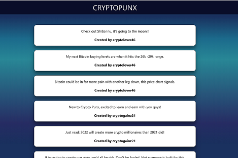

# Crypto Punx

"Crypto Punx" is an app that will allow users to both see up to date information about different cryptocurrencies as well as allow them to participate in a communal space which allows viewing and posting comments about trends and hot leads in the cryptoworld. This allows the user to make informed decisions based on what others are talking about as well as post their own insights to help others.

## Technologies Used

### APIs:

**[Coin Market Cap API](https://coinmarketcap.com/api/)**

The Coin Market Cap API provides useful data on various cryptocurrencies.

Data Used:

- Crypto Names
- Current Crypto Values
- Market Cap
- Circulating Supply

### CSS Framework:

**[Materialize](https://materializecss.com/)**

## Screenshots of Application Pages

## Deployed Application

### [Crypto Punx](https:///PoloJones.github.io/CRYPTOPUNX-PRJ2/)
